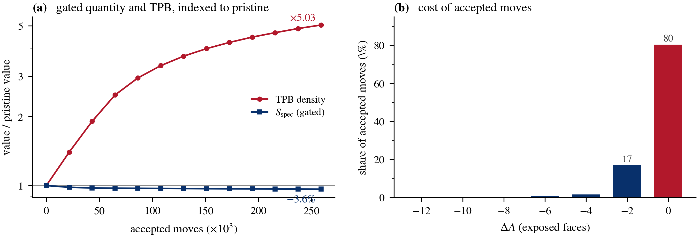

# Validation criteria that exclude their own mechanism

[](https://github.com/mehtaarnav/voxel-damage-operators-niysz/actions/workflows/ci.yml)
[](LICENSE)
[](requirements.txt)

**A simulation can satisfy every validity check its authors impose and still
move the microstructure away from the physics it represents.**

This repository contains the code, pre-registrations, run reports and
manuscript for a study of voxel-scale damage operators applied to segmented
Ni–YSZ solid oxide cell electrodes.



A coarsening rule invites one obvious criterion: that it reduce specific
surface area monotonically. Left panel: the operator does exactly that, falling
3.6 % at exact volume conservation — while triple-phase-boundary density, the
quantity the electrode exists for, rises **4.99×**. Right panel: why the gate
does not object. Four in five accepted moves change the area by *exactly* zero
and are unpriced by the criterion.

Re-applying the moves in groups shows the inflation is not diffuse. The moves
that touch the nickel–zirconia contact reproduce all of it (×5.03); every other
move — 97 % of the added material — gives ×1.04. Tightening the criterion to
strict inequality reduces the artifact without removing it.

**Surface area is the wrong invariant to validate a coarsening rule against.**

One check costs a line and disqualified three operators here: *an operator
whose TPB retention exceeds unity is roughening, not coarsening.*

## The six failure modes

Four are implementation faults — individually reasonable conventions that go
wrong in combination, and removable by choosing differently.

| # | Failure mode | What exposed it |
|---|---|---|
| 1 | **Planar lattice cuts** | A jittered lattice cuts at exactly one full cross-section with zero seed-to-seed variance; real networks fail at 0.5–3 % of throats. |
| 2 | **Over-connected gates** | Requiring perfect pristine connectivity hides that real electrodes carry 1.2–11.2 % disconnected nickel before service. |
| 3 | **Pruning circularity** | Keeping only the largest connected component makes the spanning fraction identically 1.0000 — the operator rewrites the denominator of the metric judging it. |
| 5 | **Curvature rank ≠ area change** | A curvature proxy is not the area change; specific surface area *rises* at the first step. |

Two are structural — properties of the move class itself, which no
implementation removes.

| # | Failure mode | What exposed it |
|---|---|---|
| 4 | **Voxel moves manufacture TPB** | 7–15× under erosion, 3.7–5.0× under a swap that conserves volume *and* reduces area. Neither budget constrains the three-phase junction. |
| 6 | **Area monotonicity excludes break-up** | Rayleigh neck break-up needs a transient area increase, which the criterion forbids. No operator respecting it thinned a neck. |

Numbering follows the manuscript. A pedagogical walkthrough of the physics,
the mathematics and the operator behaviour is in the
[standalone primer](out/writeup/primer.html).

---
## Repository

For a complete pedagogical breakdown of the physics, mathematics, and operator behaviors, refer to the compiled [standalone primer](out/writeup/primer.html).

---

### File map

To navigate the files in this repository, they are organized here by module and execution role:

### Core Support Library (`cmlib/`)
Located in [`cmlib/`](cmlib/):
* `damage.py` & `damage2.py`: Voxel damage operators (D4, O1, O2, O3, O5, etc.).
* `seqgreedy.py`: Sequential area-decreasing swap operator with incremental neighbour-field updates. Zero-temperature and greedy, not KMC — there is no stochastic acceptance.
* `metrics.py`: Graph-theoretic metrics (algebraic connectivity, minimum-cut, conductance).
* `percolation.py`: 3D site/bond percolation solvers.
* `tpb.py`: Interfacial triple-phase boundary (TPB) estimators.
* `particles.py`: Particle size and volume-weighted diameter calculators.
* `synth.py` & `synthvol.py`: Synthetic FCC/jittered sphere and sintering-yield generators.
* `roi.py` & `project2.py`: Region of Interest boundary handling and coordinate helpers.
* `api.py` & `io.py`: File storage and stack indexing utilities.

### Phase 1: Predictive Metrics Pipeline
Root scripts running the original connectivity margin pipeline:
* `phase0_validate_percolation.py`: Code validation comparing site percolation thresholds against literature values.
* `phase1_download.py` to `phase1_build_ground_truth.py`: Automated fetching, extracting, and formatting of Zenodo and supplementary tables.
* `phase2_inspect_labels.py` & `phase2_volume_fractions.py`: Label verification and volume fraction calculations.
* `phase3_extract_network.py` & `phase3_snow_sensitivity.py`: Watershed network extraction (SNOW) and parameter sweeps.
* `phase4a_validate_tpb.py` to `phase4e_lambda2_scaling.py`: TPB validation, particle size ordering, and Laplacian eigenvalue scaling audits.
* `phase5_percolation.py`: Spanning and reachability analysis.
* `phase6_verdict.py`: Final report tables builder.

### Phase 2: Operator Validation & Primer (`scripts/project2/`)
Located in [`scripts/project2/`](scripts/project2/):
* `test_operators.py`: Verification suite checking operator volume conservation and monotonicity (runnable via `pytest`).
* `o7_gate_a1v2_real.py` & `o7_strict_inequality.py`: Evaluates area-decreasing swaps and strict-inequality controls on real tomograms.
* `o7_tiebreak_sensitivity.py`: Demonstrates the effect of random vs. LIFO tiebreaking.
* `o7_o5v2b_rerun.py`: Runs the zero-temperature greedy swap under both neighbour-counting stencils.
* `build_primer_html.py`: Builds the standalone HTML primer, with the figures inlined as base64 PNG data URIs.
* `primer_figures.py` & `primer_figures_change.py`: Generates the figures used in the primer.
* `audit_ysz_cluster_sizes.py` & `ni_vulnerability_audit.py`: Structural vulnerability diagnostics.

### Diagnostic Probes & Notes
Root files for memory, thickness, and Skan/Porespy inspection:
* `probe_local_thickness.py` & `probe_skan.py`: Local thickness and skeleton line checks.
* `probe_snow2_parallel_bug.py`: Demonstrates a parallel processing bug in SNOW2.
* `IMPACT_NOTE_porespy_parallel_bug.md`: Summary of the SNOW2 parallel dispatch issue.

---

### Running the code

### Environment Verification
To verify your Python environment carries the required scientific stack, run:
```bash
python check_env.py
```

### Running Unit Tests
Validate the damage operators, TPB counters, and percolation estimators using `pytest`:
```bash
pytest
```

### Building the Primer Report
To compile the standalone report and generate all primer figures:
```bash
python scripts/project2/build_primer_html.py
```
This generates:
* Markdown: `out/writeup/PRIMER_voxel_operators.md`
* Inlined HTML: `out/writeup/primer.html` (fully self-contained, no external requests).

---

## Data, licensing and citation

**The tomography data is not in this repository and is not redistributed by
it.** The segmented stacks are the Holzer/Pecho Ni-YSZ FIB-tomography dataset,
published separately at [Zenodo 4056538](https://zenodo.org/records/4056538)
under its own terms. `phase1_download.py` fetches it into `data/`, which is
gitignored. Fetched papers and supplementary files land in `refs/`, also
gitignored, for the same reason.

Code in this repository is MIT licensed (see `LICENSE`). The manuscript and
the primer are the author's own text and figures.

To cite the software, see `CITATION.cff`. To cite the findings, cite the paper.

## What reproduces from a clean checkout

Everything that depends only on committed code and seeds regenerates from a
clean checkout. Anything that reads the tomograms requires the Zenodo download
first, which is roughly 2.2 GB.

Numbers quoted in the manuscript trace to committed CSVs under `out/`; the
mapping is given in the paper's data-availability section and in
`out/writeup/REPRODUCIBILITY_MANIFEST.md`.
