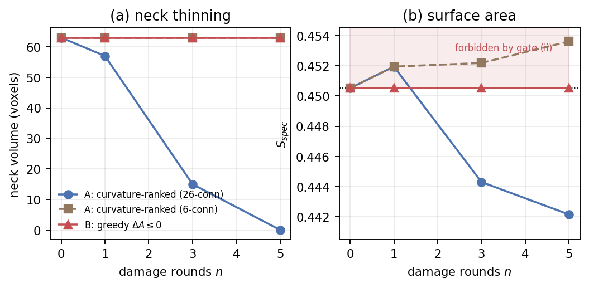
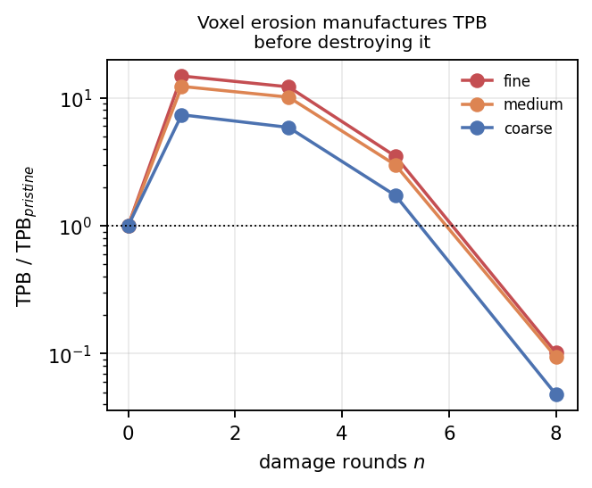
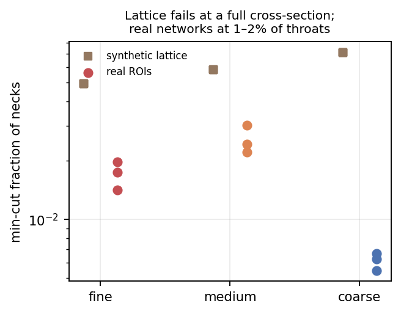
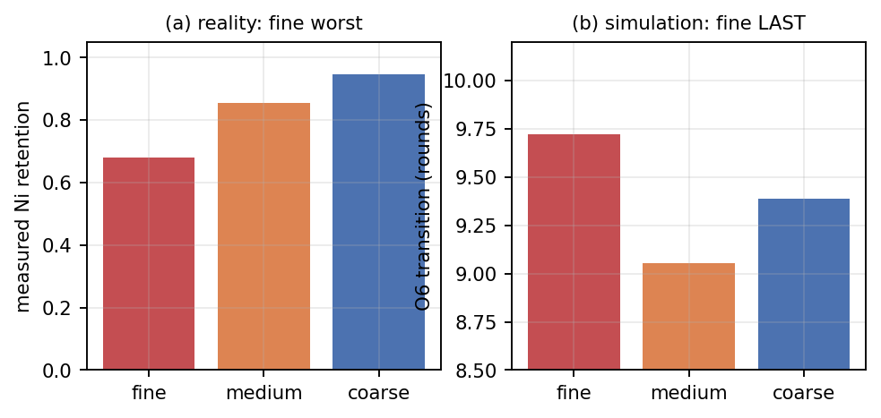

# When the validation criterion excludes the mechanism: six artifact classes in voxel-based modelling of Ni–YSZ electrode degradation

**Manuscript draft — 2026-08-11**

Target: *Acta Materialia* (Part B lead) · Alternate: *Journal of Power Sources* (Part A lead)

Every quantity traces to a committed dataset and a version-control hash (§9).
References carry explicit verification status (§10); none was checked against a
source in this environment, and items marked ⚠ or ✂ must be resolved before
submission.

---

## Abstract

Voxel-based damage operators applied to segmented tomograms are a standard tool
for simulating microstructural degradation in solid oxide cell electrodes.
Working from FIB-SEM reconstructions of three Ni–YSZ anodes spanning a
coarseness series, we tested whether such operators reproduce the measured
degradation signature, in which the finest anode retains Ni percolation worst
(0.680 against 0.855 and 0.947) yet retains triple-phase boundary best. They do
not, and the reasons are methodological rather than physical.

We report six artifact classes. The most general is an impossibility:
**enforcing monotone surface-area reduction — the natural way to validate a
coarsening operator — structurally excludes Rayleigh-type neck break-up, the
mechanism such operators are built to represent.** We establish this by
bracketing rather than by a single experiment. A curvature-ranked operator
reproduces neck thinning, driving a model neck from 63 voxels to zero, but
violates area monotonicity at its first step. A greedy area-decreasing operator
never violates it and accepts *zero* moves, because a sphere–neck–sphere body is
already a single-voxel local minimum. Finite-temperature acceptance bridges the
two and is precisely what an area-monotonicity gate forbids.

The remaining five are: connectivity metrics that are pruning-dependent, so that
an operator retaining only the largest component drives the spanning fraction to
unity identically; voxel-scale erosion that manufactures triple-phase boundary
seven- to fifteen-fold before destroying it; synthetic qualification gates
demanding perfect pristine connectivity, against real electrodes that carry
1.2–11.2 % disconnected Ni; regular lattices whose minimum cut is exactly one
full cross-section with zero seed-to-seed variance, where real networks fail at
1–2 % of throats via small non-planar cuts; and curvature-ranked moves that do
not guarantee the area reduction they are assumed to deliver.

Four candidate mechanisms were eliminated and two further routes closed without
reaching a mechanism test. All work was pre-registered, with every amendment
committed before the run it governed, and five self-corrections against our own
earlier claims are recorded as part of the result.

---

## 1. Introduction

Nickel–yttria-stabilised-zirconia cermet anodes degrade in service through
microstructural change. The nickel phase coarsens and can lose the percolating
network that carries electronic current; the ceramic scaffold can fracture; and
the triple-phase boundary (TPB), the one-dimensional locus where nickel, zirconia
and pore meet and where the electrochemical reaction proceeds, is consumed.
Because these are geometric processes acting on a resolvable microstructure, a
natural computational approach is to apply a voxel-scale damage operator to a
segmented tomogram and track how connectivity and TPB evolve ⚠[R7,R8].

The experimental target is unusually sharp, and unusually counter-intuitive.
Across the Holzer/Pecho anode series ✓[R1,R2] the finest microstructure retains
nickel percolation *worst* while retaining TPB *best*:

| anode | Ni percolation retained | TPB retained (this work) | TPB retained (published) |
|---|---|---|---|
| fine | **0.6795** | **0.7993** | **0.7434** |
| medium | 0.8547 | 0.7460 | 0.5862 |
| coarse | 0.9470 | 0.5897 | 0.6075 |

*Source: `phase6_comparison_table.csv` (`47b08ee`).*

Two cautions travel with this table throughout the paper, and both are
consequences of how the data were acquired rather than of how they were
analysed. First, **medium versus coarse is not resolved on the nickel side**: it
flips depending on whether percolation is defined by two-face spanning or by
reachability from one face. Second, **the published TPB series is not monotone**
— coarse (0.6075) exceeds medium (0.5862) — so only the two-level statement
*"fine retains TPB best"* is defensible; the full three-level ordering appears in
our measurement alone. We therefore make only the two-level claims, on both
phases.

Our original aim was to identify which damage mechanism reproduces this
signature. We did not achieve it. What we obtained instead is a bounded negative
result — two principal geometry-based operator classes tested and neither
reproducing the ordering — together with six methodological artifacts, each of
which was invisible on synthetic test structures and each of which would
silently corrupt a published study of this kind. We argue that the second of
these is the more useful contribution, and we lead with it.

## 2. Materials and methods

### 2.1 Data

Six segmented FIB-SEM stacks were used: three anodes (designated fine, medium
and coarse by mean nickel particle size) in pristine and post-redox states, of
0.48–1.11 Gvoxel each, at voxel pitches of 19.53–29.14 nm ✓[R1,R2]. Phase
labelling was verified against published volume fractions, with a worst
deviation of 0.20 % across eighteen values.

**Pristine and degraded stacks are different specimens** (Rx36/Rx37/Rx38 versus
Rx41-1/Rx41-2/Rx41-3), not the same volume imaged twice. Every retention
magnitude is therefore confounded with specimen-to-specimen variation. This is a
property of the dataset, and it is the principal reason all comparisons in this
work are ordinal.

### 2.2 Percolation and connectivity

Phase connectivity uses 6-connectivity (face-sharing) with free, non-periodic
boundaries; a cluster percolates if a single connected component reaches both
extreme slices of the transport axis. The implementation recovers the
simple-cubic site-percolation threshold as 0.31218 after finite-size
extrapolation, against a reference value of 0.3116077 ✓[R3].

### 2.3 Network extraction

Particle networks were extracted by watershed partitioning of the Euclidean
distance transform ✓[R4], applied to the solid phase. Nodes are nickel chambers,
edges are throats carrying a measured inscribed diameter and cross-sectional
area. A defect in the library's default parallel dispatch was identified and
corrected during this work; its quantified impact on the earliest extractions is
smaller than the reported between-region spread and changes no conclusion.

### 2.4 Outcome metric

Following the discovery of artifact B1 (§3.2) we adopted

> **R_Ni = spanning-cluster nickel voxels ÷ pristine nickel voxels**,

which is invariant to the deletion of isolated material, monotone
non-increasing under any removal operator, and directly comparable to measured
retention. Its mandatory sanity check — that R_Ni evaluated on the undamaged
structure equals the pristine spanning fraction — holds to 0.00 × 10⁰ in all
three anodes.

### 2.5 Statistics

There are three anodes. **No p-values are reported anywhere in this work, by
design**, and none should be computed from three points. Where correlations are
reported they are Spearman rank coefficients with leave-one-out sign checks
against a threshold of |ρ| ≥ 0.6 fixed in advance.

### 2.6 Pre-registration

Each phase of the work was pre-registered in a version-controlled document
committed **before** the run it governed, specifying the operator definition,
frozen parameters, validity gates, decision rules and failure branches. The
chain of commits is given in §9. Where a pre-registered rule later proved
ill-chosen, the rule was honoured and the defect reported rather than
retrospectively amended.

---

## 3. Part B — Six artifact classes

Each is stated as what it is, the measurement that exposed it, and the property
of synthetic test structures that concealed it.

### 3.1 B6 — Monotone area reduction excludes Rayleigh-type break-up

Coarsening is driven by the reduction of interfacial area at fixed volume. It is
therefore natural, and superficially rigorous, to validate a coarsening operator
by requiring that it reduce specific surface area monotonically. We show this
criterion is not merely conservative but self-defeating.

For a single-voxel swap on a 6-connected lattice the area change is exact rather
than approximate. Removing a surface voxel *a* changes the count of exposed
nickel faces by 2·nb(*a*) − 6, where nb counts nickel neighbours; adding a voxel
at a pore site *b* changes it by 6 − 2·nb(*b*). Hence

> **ΔA = 2·[nb(a) − nb(b)]**,  and therefore  **ΔA ≤ 0 ⟺ nb(a) ≤ nb(b)**.

Material must leave a site with few nickel neighbours (convex, high curvature)
and arrive at one with many (concave, low curvature) — the expected direction.

**Figure 1.** Two operators bracket an impossibility on a sphere–neck–sphere test
body (neck 63 voxels, pristine S_spec = 0.45052). **(a)** The curvature-ranked
operator with a 26-connectivity stencil thins the neck to zero; with
6-connectivity it does nothing at all; the greedy ΔA ≤ 0 operator does nothing.
**(b)** The same runs in surface area. The curvature-ranked operator enters the
region forbidden by the validity criterion at n = 1 (0.45195 against a pristine
0.45052) before falling below pristine at n = 3. The greedy operator never
leaves the pristine line, because it accepts **zero** moves.
*Sources: `o5v2_report.md` (`c38218d`), `o5v2_optionB_report.md` (`84bcc61`).*

The greedy acceptance rate is exactly zero, and not through any implementation
fault. In a sphere–cylinder–sphere geometry the least-convex surface voxel still
has more nickel neighbours than the most-concave available pore site
(nb_a,min > nb_b,max), so every candidate pair is rejected at the first
comparison. **The body is already a local minimum with respect to single-voxel
moves.** Spheres minimise area at fixed volume, and a straight cylinder is stable
against any *individual* voxel displacement; Rayleigh-type break-up requires a
correlated set of voxels to move together, transiently *raising* area before the
instability lowers it ⚠[R5,R6].

The two operators therefore bracket the entire space of single-swap algorithms.
One crosses the energy barrier without pricing it, and violates the criterion.
The other prices the barrier and refuses to cross, and does nothing. The only
bridge is finite-temperature acceptance of area-increasing moves — which is
exactly what an area-monotonicity gate forbids by construction.

The consequence for practice is direct. **Any voxel-based coarsening study that
both enforces monotone surface-area reduction and claims to reproduce
Rayleigh-type neck break-up is either not producing that break-up, or is
violating its own validity criterion.** The two cannot hold together.

What concealed this: on synthetic lattices the operator was never asked to thin a
neck against an explicit area budget, because the structures were already
fully connected and the validation focused on connectivity rather than area.

### 3.2 B1 — Pruning-dependence of connectivity metrics

The spanning fraction P_span divides spanning-cluster voxels by *total phase*
voxels. Damage operators conventionally retain only the largest connected
component, on the physical grounds that isolated nickel is electrically dead.
These two conventions are incompatible: the pruning step deletes exactly the
non-spanning voxels, so after pruning the surviving component *is* the spanning
one and P_span becomes unity identically. **The operator rewrites the
denominator of the metric used to judge it.**

Measured on real regions of interest, pristine P_span of 0.9821, 0.9713 and
0.8878 became **exactly 1.0000** at the first damage step, for two independently
implemented operators. The defect is resolved by the pruning-invariant R_Ni of
§2.4.

What concealed this: a synthetic qualification gate that *required* pristine
P_span = 1.0000, leaving nothing for the pruning step to remove.

### 3.3 B2 — TPB manufacture by voxel-scale erosion

**Figure 4.** TPB density relative to pristine under reduction-only surface
erosion applied to real regions of interest. TPB rises seven- to fifteen-fold
before collapsing. Stochastic single-voxel removal pits the nickel surface, and
every newly created nickel/pore facet that touches zirconia creates triple line.
Any TPB conclusion drawn before the peak is an artifact of discretisation rather
than a statement about the electrode. *Source: `c1real_rni_gate.csv` (`10f2c51`).*

What concealed this: a synthetic platform whose absolute TPB was already roughly
eightfold too high, so a further large excursion did not appear anomalous.

### 3.4 B3 — Over-constrained pristine connectivity

Real electrodes are not perfectly connected before service. Measured per-region
pristine spanning fractions are 0.9821/0.9754/0.9877 (fine), 0.9713/0.9446/0.9554
(medium) and 0.8878/0.9528/0.9157 (coarse) — that is, **1.2 % to 11.2 % of the
nickel is already disconnected**, and the fraction is coarseness-ordered.

Synthetic platforms that require perfect pristine connectivity as a
qualification criterion are therefore unrepresentative of every real electrode
measured here. That requirement is also what concealed B1 for the entire
synthetic phase of this work.

### 3.5 B4 — Lattice minimum-cut planarity

**Figure 2.** Minimum source–sink cut as a fraction of all necks, on a
logarithmic axis. A jittered regular lattice cuts at exactly one full
cross-section — 36 = 6², 25 = 5², 16 = 4² — with **zero** seed-to-seed variance
across fifteen structures. Real regions cut at 1–2 % of throats with genuine
region-to-region spread. *Sources: `audit_ni_vulnerability.csv` (`58bc6db`),
`c1real_results.csv` (`307a220`).*

Random and low-area attacks never disconnect the lattice, even after removing
half of all necks. A regular lattice has no locally weak plane: every
cross-section is statistically identical, so the minimum cut is a plane and its
size is fixed by geometry rather than by microstructure. **Such a network cannot
fail in the way a real network fails**, and no local stochastic operator can make
it do so. Adding bond dilution does not help — a diluted regular lattice remains
statistically homogeneous at large scale, and the cut plane merely shrinks.

Real networks, by contrast, are genuinely disordered: connected-pair-distance
coefficients of variation of 0.38–0.45 and coordination standard deviations of
1.8–2.9, against a lattice whose interior coordination is fixed.

### 3.6 B5 — Curvature-ranked moves do not guarantee area reduction

Ranking candidate moves by curvature is a *proxy* for the area change, not the
area change itself. On a discrete lattice an added voxel exposes new faces at its
own free sides, and at the first step that transient exceeded the area removed —
0.45195 against a pristine 0.45052 — under both 6- and 26-connectivity stencils
(Figure 1b). The exact identity of §3.1 is the remedy, and its derivation is what
converts B5 from a puzzle into B6.

---

## 4. Part A — Systematic elimination of candidate mechanisms

Four mechanisms were tested to a result. Two further operator routes closed
without reaching a mechanism test, and are reported as such rather than counted
as eliminations.

| # | mechanism | outcome | key quantity |
|---|---|---|---|
| 1 | lower-tail neck widening | **no lever** | 8.54 / 8.50 / 8.50 rounds; −0.04, ≈25× below threshold |
| 2 | narrow-neck severing | **no failure** | 100 % of lower-quartile throats severed; P_span = 1.0000 in 15/15; 1.8 % volume lost |
| 3 | ceramic contact fracture | **pristine-loaded, not mechanistic** | +2.87 rounds → matched-fragility control **−0.27** |
| 4 | surface erosion on real data | **reverses the measured ordering** | Figure 3; all \|ρ\| ≤ 0.213 |
| — | volume-conserving redistribution | operator invalid (surface area +3.3 %) | mechanism untested |
| — | volume-conserving coarsening | route closed by B6 | mechanism untested |

**Mechanisms 1 and 2 are complementary and mutually reinforcing.** Widening the
narrow-neck population of a synthetic electrode at conserved nickel loading
conferred no retention benefit; severing *every* throat in the lower quartile of
the size distribution caused no percolation failure at all, at a cost of 1.8 %
of the nickel volume. The minimum-cut audit explains both: critical edges overlap
the lower-quartile neck population at 0.250, 0.280 and 0.188 for the three
classes, against a chance expectation of 0.25. **The narrow necks are not
load-bearing**, so neither strengthening nor destroying them changes the outcome.

**Mechanism 3 illustrates why controls matter.** The main experiment showed a
clean 2.87-round separation in the predicted direction, with non-overlapping
seed ranges and every bisection bracketing cleanly — a result that would have
read as a confident positive. A matched-fragility control, in which pristine
ceramic fragility was equalised across the three classes while grain size was
allowed to vary, **inverted it to −0.27 rounds**. The apparent mechanism was
pristine-state loading: the class calibrated to start closest to its percolation
threshold failed first, as it must.

**Figure 3.** **(a)** Measured nickel percolation retention: the fine anode is
worst. **(b)** Transition intensity under reduction-only surface erosion applied
to the same real microstructures: **the fine anode is last to fail.** The
simulation inverts the experiment. Neither specific surface area (ρ ≤ +0.089) nor
pristine minimum-cut fraction (ρ ≤ +0.213) correlates with transition intensity,
raw or partial. *Sources: `c1real_results.csv` (`307a220`),
`phase6_comparison_table.csv` (`47b08ee`).*

Mechanism 4 is the decisive negative. Applied to real, disordered, properly sized
microstructures with a validated operator and a well-posed metric, surface
erosion produces the opposite ordering to the one measured, and neither candidate
predictor — a kinetic one (specific surface area) nor a topological one (minimum
cut) — explains the outcome.

## 5. Part C — Positive findings

Four results stand independently of the negative programme.

**5.1 Real nickel networks fail at 1–2 % of throats.** Minimum-cut fractions are
0.0141–0.0196 (fine), 0.0221–0.0302 (medium) and 0.0055–0.0067 (coarse), via
small, region-variable, non-planar cuts (Figure 2). Any synthetic generator
intended to reproduce this must hit mean coordination 3.4–3.9 with standard
deviation 2.0–2.4 and connected-pair-distance coefficient of variation ≈ 0.41.

**5.2 Pristine disconnection is real and coarseness-ordered** (§3.4), and is a
platform-fidelity result independent of any damage model.

**5.3 The coarse fragility paradox.** The coarse anode is three- to fivefold the
most topologically fragile of the three, yet is the best retainer in service
(0.947). **Pristine topology does not predict degradation** — and neither does
specific surface area. This is the sharpest statement the dataset supports about
what does *not* control the ordering.

**5.4 A validated TPB estimator.** Corrected for a periodic-wrap defect that
over-counted by exactly fourfold on an analytic test case, the estimator returns
4.48–4.66, 1.87–2.37 and 1.47–1.55 µm⁻² for the three anodes against published
values of 3.62, 2.11 and 1.47 — a factor of 1.0–1.3. The roughly eightfold
inflation observed earlier in this work was a property of synthetic phase
placement, not of the measurement.

## 6. A further hypothesis, and why it could not be tested

A reviewer or reader will reasonably ask whether the ordering arises not from
local geometry at all but from *redistribution* — nickel migrating from the
electrolyte-adjacent functional layer into the support, most strongly in the
finest microstructure. We pre-registered this hypothesis with an explicit
untestability branch and then tested it.

The branch fired. The criterion for an electrolyte interface to be present in a
stack — a sustained gradient of at least 0.05 in absolute zirconia volume
fraction between its two ends — is met in only one of three pairs, **and not in
the fine anode, which is the anode the hypothesis concerns**: gradients are
0.0042 and 0.0240 (fine, both states), 0.0059 and 0.0552 (medium), 0.1035 and
0.1157 (coarse). Nickel content does vary strongly with depth in every stack —
coarse post-redox spans 0.045 to 0.494 — but in fine and in pristine medium that
variation is not organised as a monotone interface gradient. It is spatial
heterogeneity, which is a different thing.

The most likely explanation is prosaic: these sub-volumes lie within a single
layer. The stacks are 19–24 µm across the through-thickness direction, against a
support hundreds of micrometres thick, and there is no reason a given tomogram
must straddle the interface.

**The hypothesis is therefore neither supported nor rejected. It is unasked,
because these data cannot pose the question.** Testing it requires tomograms
deliberately acquired across the electrolyte interface, and ideally the same
specimen imaged before and after service — neither of which this dataset
provides. We report it here because a pre-registered untestable outcome is
information, and because the alternative — redefining the interface until a
number emerges — is precisely the failure mode this paper is about.

---

## 7. Discussion

The six artifacts share a structure worth naming. In each case a modelling
convention that is individually reasonable becomes wrong in combination with
another, and the combination is invisible on the synthetic structures normally
used for validation.

Retaining only the largest connected component is reasonable; measuring the
spanning fraction against total phase volume is reasonable; together they are
circular (B1). Requiring perfect pristine connectivity of a synthetic analogue is
reasonable; it also removes the very condition under which the circularity would
have been visible (B3). Validating a coarsening operator by monotone area
reduction is reasonable; so is expecting it to reproduce capillary break-up;
together they are contradictory (B6).

This suggests a general prescription: **validation criteria and mechanisms must
be checked for compatibility explicitly, and preferably on structures that are
imperfect in the way real ones are.** A synthetic test object that is fully
connected, periodic and smooth will pass validation suites that a real
microstructure would fail, and will conceal exactly the interactions that matter.

The negative programme should be read with corresponding care. We have shown
that two geometry-based operator classes do not reproduce the measured ordering.
We have not shown that no geometric mechanism can, and we certainly have not
shown that agglomeration is not the physical cause of nickel percolation loss —
B6 says we could not test agglomeration with this class of operator, which is a
statement about the method. Continuum and phase-field formulations are not
subject to the single-voxel argument of §3.1, and are the natural next approach.

## 8. Conclusions

1. Enforcing monotone surface-area reduction as a validity criterion structurally
   excludes Rayleigh-type neck break-up. The criterion and the mechanism cannot
   both be honoured by a single-voxel-swap operator.
2. Five further artifact classes — pruning-dependent connectivity metrics, TPB
   manufacture by voxel erosion, over-constrained pristine connectivity, lattice
   minimum-cut planarity, and curvature-ranked moves that do not reduce area —
   were each invisible on synthetic structures and each would corrupt a published
   study of this type.
3. Four candidate mechanisms were eliminated; two further routes closed without
   reaching a mechanism test.
4. Real nickel networks fail at 1–2 % of throats via localised non-planar cuts,
   carry 1.2–11.2 % disconnected nickel when pristine, and exhibit a fragility
   paradox in which the most topologically fragile anode is the best retainer.
5. Neither pristine topology nor specific surface area predicts the measured
   degradation ordering.

## 9. Reproducibility, pre-registration and self-correction

**Every amendment was committed before the run it governed.** Chain:
`e62f30b` → `8e77035` → `52aa519` → `b278dc5` → `cb2ca49`/`971f0ba` →
`267efd3`/`58bc6db` → `50b0bde`/`c41e4fa` → `49b1059`/`0aa6276` →
`f980562`/`ff3e5d1` → `bfc5d89`/`10f2c51` → `307a220` → `304aa8a`/`c38218d` →
`c414e63`/`84bcc61` → `5dda4ac`/`0bccf20`.

**Quantity → source.** §4 mechanism 1 `p10_group_experiment.csv`; mechanism 2
`step2_O2_ceiling_check.csv`; mechanism 3 `step2_O3_main.csv` with
`step2_O3_control.csv`; mechanism 4 and Figures 2–3 `c1real_results.csv`;
§3.2/§3.4 `c1real_o6_validity.csv`, `c1real_rni_gate.csv`; §3.3 and Figure 4
`c1real_rni_gate.csv`; §3.5 `audit_ni_vulnerability.csv`; §3.1/§3.6 and Figure 1
`o5v2_report.md`, `o5v2_optionB_report.md`; §6 `h1_depth_profiles.csv`,
`h1_layer_summary.csv`; measured outcomes `phase6_comparison_table.csv`.
Figures regenerate via `scripts/project2/make_figures.py`.

**Self-corrections against our own work**, recorded as part of the result:

1. A TPB estimator that over-counted by exactly fourfold through periodic wrap
   at domain faces.
2. Reversed axis extents that rendered one audit's cut fractions provisional
   until re-run.
3. A pre-registered secondary-outcome rule that selected a saturating
   measurement point, leaving a null with no secondary support; reported rather
   than re-picked.
4. A validity check that compared only across damage intensities, never against
   the pristine state, and printed PASS on a failing run.
5. An internally contradictory plan specifying both Metropolis acceptance and
   strict area monotonicity; resolved to greedy acceptance.

**Controls that caught would-be false positives:** the matched-fragility control
of §4, which inverted a +2.87-round apparent result to −0.27; and a provenance
verification of synthetic structures — 67,803 differing voxels, 46 of 224 necks
changed — performed before an earlier null was accepted.

## 10. References and verification status

**No reference below was checked against a source in this environment.**
✓ = recorded in the project repository from earlier verified work;
⚠ = from memory, plausible, **must be verified**; ✂ = cut unless verified.

| # | reference | status |
|---|---|---|
| R1 | Pecho et al., *Materials* — Ni–YSZ transport and percolation (PMC5512617) | ✓ |
| R2 | Holzer et al., *Materials* — Ni–YSZ triple-phase boundary (PMC5455394) | ✓ |
| R3 | Xu, Wang, Lv & Deng, *Phys. Rev. E* **89**, 012120 (2014) — simple-cubic site threshold 0.3116077 | ✓ |
| R4 | Gostick, *Phys. Rev. E* **96**, 023307 (2017) — watershed network extraction | ✓ |
| R5 | Rayleigh / Plateau — capillary instability of a liquid cylinder | ⚠ |
| R6 | Nichols & Mullins — surface-diffusion break-up of solid cylinders, *J. Appl. Phys.* (1965) | ⚠ |
| R7 | Simwonis, Tietz & Stöver, *Solid State Ionics* **132** (2000) — Ni coarsening | ⚠ |
| R8 | Sarantaridis & Atkinson, *Fuel Cells* **7** (2007) — redox cycling review | ⚠ |
| R9 | Herring — scaling laws in sintering, *J. Appl. Phys.* **21**, 301 (1950) | ⚠ |
| R10 | Faes / Grew et al. — coarsening simulated on FIB-SEM reconstructions | ✂ |
| R11 | NiO/Ni molar volumes ≈ 11.2 / 6.59 cm³ mol⁻¹ | ⚠ |
| R12 | Bond-percolation thresholds: SC 0.2488, BCC 0.1803, FCC 0.120 | ⚠ |

**Submission blocker.** R5–R12 must be verified or cut. **The measurement
underlying §3.1 does not depend on R5 or R6**: the bracketing of Figure 1 stands
on its own, and only the attribution to Rayleigh-type break-up requires those
citations. If they cannot be verified, §3.1 is reported as an area-barrier
impossibility without the Rayleigh framing and loses nothing essential.
